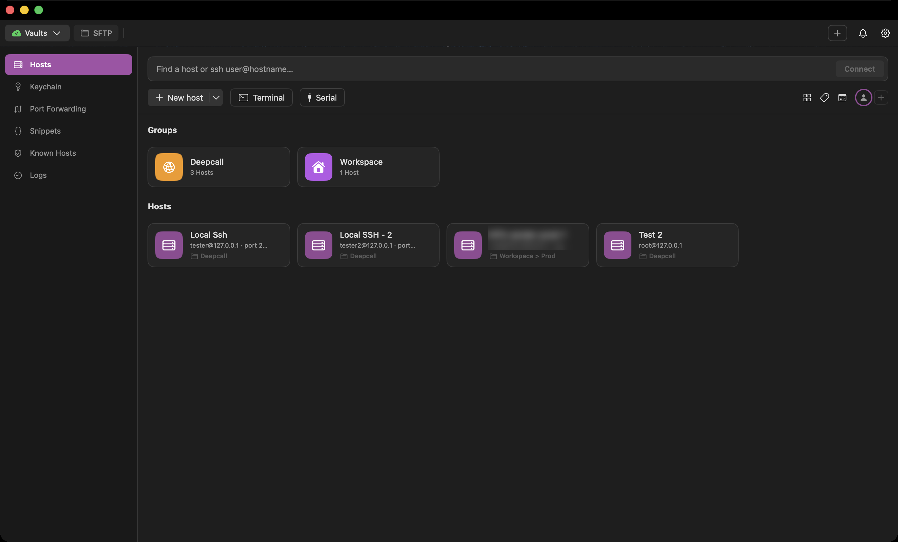
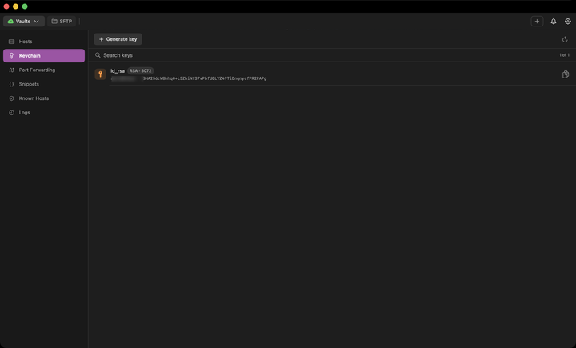
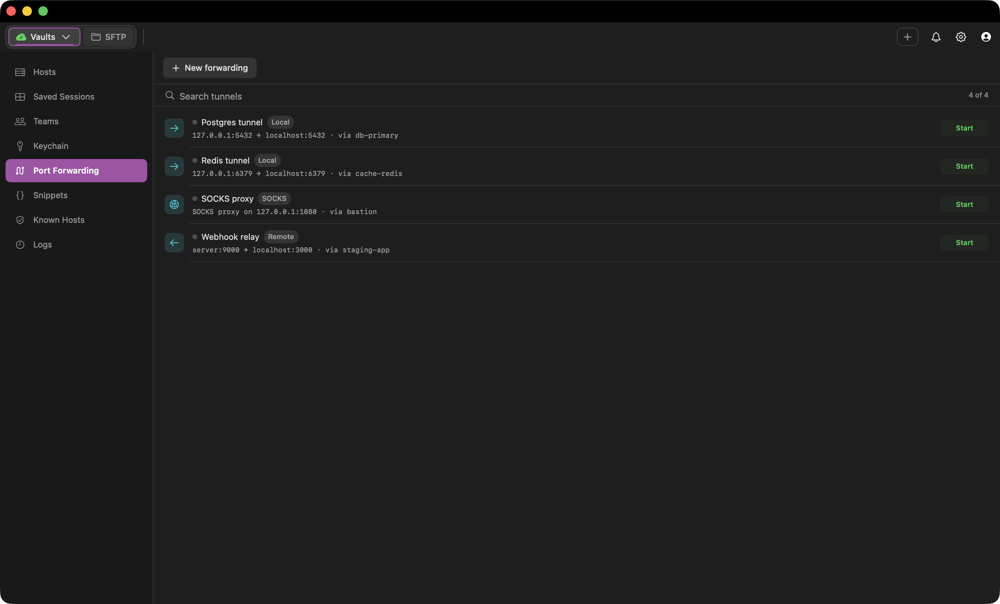
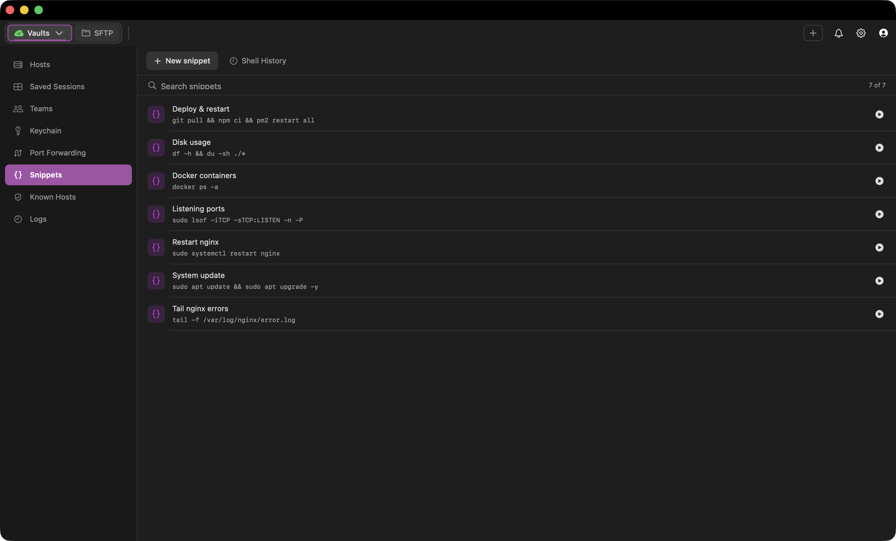
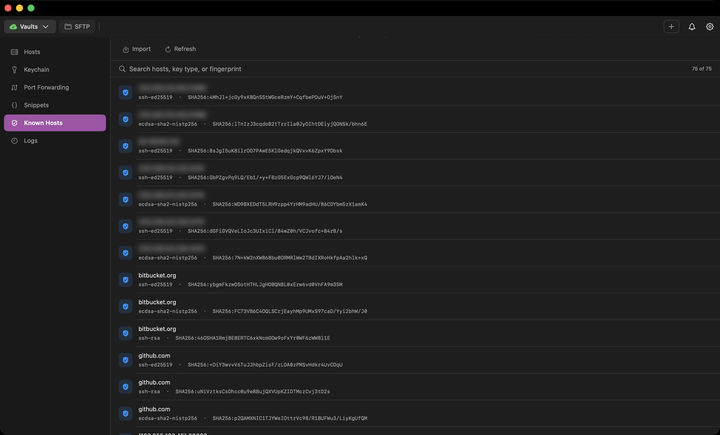
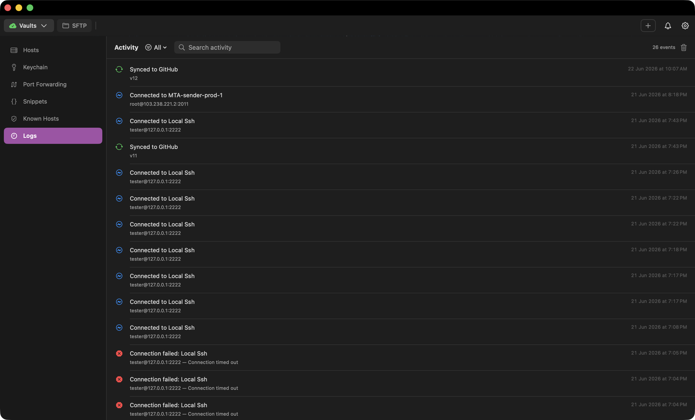
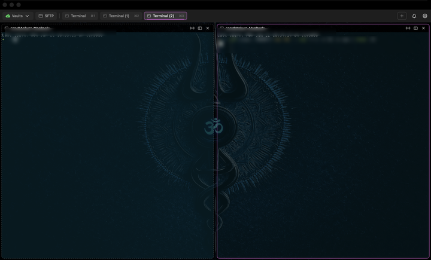
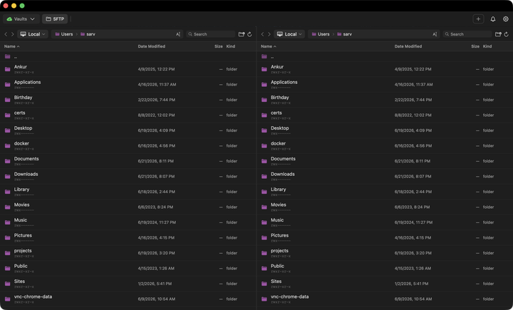
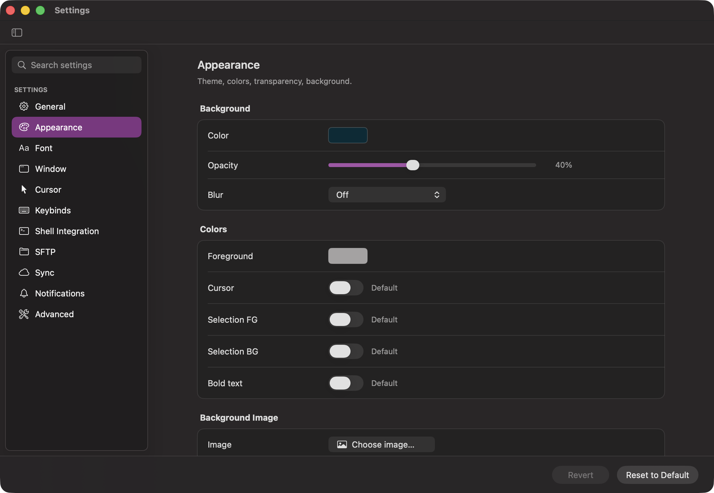
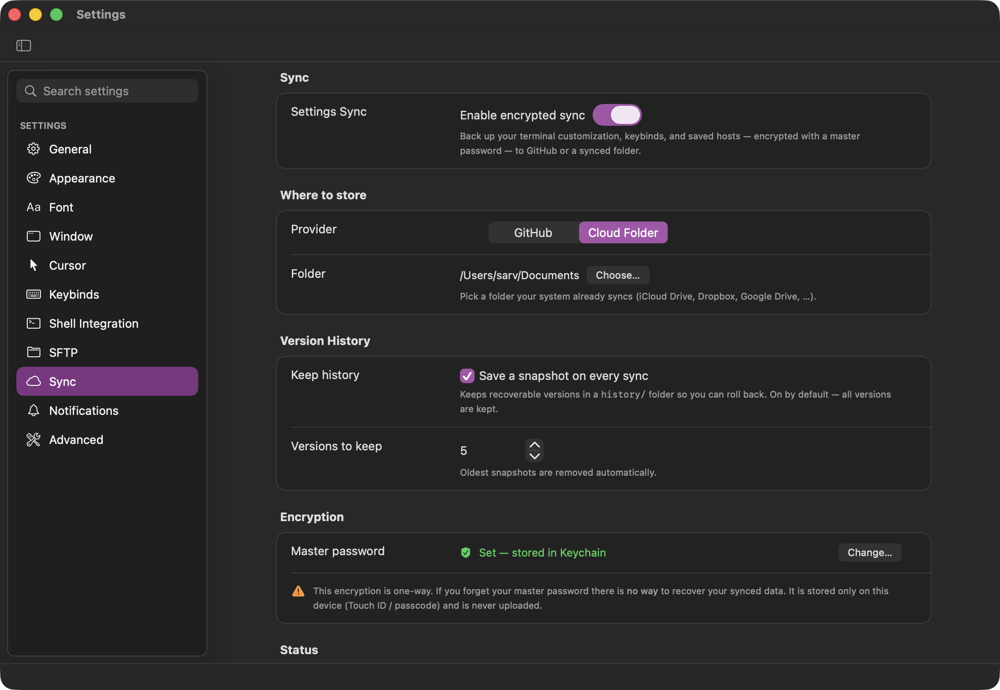

<p align="center">
  
</p>

<h1 align="center">Sarv Terminal</h1>

**The open-source Mac terminal for people who manage servers.**
Fast GPU-accelerated terminal, saved connections, SFTP/SCP, SSH keys, tunnels, container attach,
and encrypted settings sync — in one native app.

[Website](https://sarv.com) · [Features](#features) · [Where we fit](#where-sarv-terminal-fits) · [Security & Privacy](#security--privacy) · [Install](#install) · [Build](#build-from-source) · [FAQ](FAQ.md) · [Launch plan](MARKETING-LAUNCH-PLAN.md) · [Contributing](#contributing) · [Credits](#credits--license)


---

## About

Traditional terminal emulators and dedicated SSH managers solve different parts of remote work.
Sarv Terminal brings them together: a native macOS terminal where saved servers, SSH keys, tunnels,
file transfers, container shells, and terminal sessions live in one workspace. Optional encrypted
sync uses a selected private GitHub repository or folder.

It is built for developers and operators who live in the terminal and manage more than one server.

## Features

We retain Ghostty's fast GPU rendering, ligatures, true color, and native macOS feel, then add the
**Sarv Terminal layer.** Each section below shows the feature in action.

### 🗄️ Connection Manager (Vaults)
- **Saved hosts** with a full SSH profile: user, port, identity file, agent forwarding, compression,
  keep-alives, proxy jump, host-key policy, and a startup command.
- **Groups & tags** — organize servers into a workspace → project folder tree.
- **Per-host themes** — each server can open with its own color theme so the active server context
  remains visible.
- **Guided connect popup** with **auto-reconnect** on network drops / wake-from-sleep, and clean
  inline error handling.
- **Import** hosts from an existing `~/.ssh/config` (following `Include`s), **iTerm2**, CSV, PuTTY,
  MobaXterm, or SecureCRT.
- **Command palette / quick-connect** to jump to any host or action.



### 🔑 SSH Key Manager
- See every key in `~/.ssh` with its type, size, fingerprint, and comment.
- **Generate** new keys (Ed25519 / ECDSA / RSA-4096) with an optional passphrase and comment.
- **Copy the public key** in one click (to paste into a server's `authorized_keys` or GitHub),
  copy the path, reveal in Finder, or delete safely.



### ↔️ Port Forwarding
- Save **Local (`-L`)**, **Remote (`-R`)**, and **Dynamic / SOCKS (`-D`)** tunnels.
- Each tunnel runs over a saved host; **start/stop** with a live status indicator and
  inline error reporting (e.g. "port already in use").



### 🧩 Snippets
- A library of frequently used commands; run them straight into the focused terminal or copy them.
- **Shell History** — browse recent shell commands (zsh / bash / fish) in a side panel and
  **save any of them as a snippet** in one click.



### ✅ Known Hosts & 🪵 Activity Logs
- Browse and manage `~/.ssh/known_hosts`.
- A running activity log of connections and session events.





### 🖥️ Terminal Workspace
- **Embedded tabs and splits** in a single window, with **focus mode**, **input broadcasting**
  across panes, tab colors & renaming, an **all-tabs overview**, and **reopen-closed-tab**.



### 🤖 AI Command Assist
- When a command **fails**, a one-click banner offers to **explain the failure and suggest a fix** —
  the suggested fix pastes straight into the focused terminal.
- We support **user-supplied API keys** for **Claude** and **OpenAI**, or a **local model via Ollama**
  (fully offline). Provider keys are **stored encrypted on the Mac and never synced**. Requests go
  only to the configured provider.

### 🐳 Docker & Kubernetes Attach
- An **Attach** panel lists running **Docker containers** and **Kubernetes pods**.
- Click to open an interactive shell **inside** a container/pod — in a new tab or the current one —
  without hand-typing `docker exec -it …` / `kubectl exec -it …`.

### 🔌 Serial Console
- Connect to a device over a **USB-serial adapter** (console cables for routers/switches, Raspberry
  Pi, microcontrollers, etc.) right from the Hosts screen or the command palette.
- Pick a detected `/dev/cu.*` device and a baud rate; opens a session in a terminal tab (8-N-1, via
  the built-in `screen`).
- A built-in **"report an issue"** helper opens a pre-filled GitHub issue — serial behavior is
  hardware-specific, so adapter and chipset details are easy to include when something is off.

### 📁 SFTP / SCP Dual-Pane File Manager
- Transfers run over **both SFTP and SCP** — SFTP for local ⇄ remote browsing/transfer, and **SCP for
  direct server-to-server (server ⇄ server) transfers**.
- Browse **local ⇄ remote** side by side and transfer between them.
- **Direct server-to-server transfers** — copy a file from one server straight to another (via SCP)
  without it passing through the Mac, with an automatic **relay-through-this-Mac fallback** when the
  two servers can't reach each other directly.
- **Live transfer progress** (file name, size, speed, %, bytes) with a **Cancel** button, and a clear
  *Server → Server* vs *Via this Mac* indicator.
- **In-app file viewer & editor** for remote and config files.
- **Two-way permissions editor** — set permissions with `rwx` checkboxes **or** an octal field, kept
  in sync live.



### 🎨 Customization
- Appearance: themes, **background image** with adjustable opacity & blur.
- Font, cursor, window, tabs, and shell-integration settings.
- **Fully rebindable app keybinds** that never clobber Ghostty's defaults.



## Where Sarv Terminal fits

We position Sarv Terminal between modern terminal emulators and dedicated SSH managers:

| Product | Best fit |
|---|---|
| **Sarv Terminal** | We combine a native macOS terminal with visual server operations in one local-first, open-source app. |
| **Ghostty / iTerm2 / WezTerm** | Strong terminal experiences with remote workflows assembled from CLI tools. |
| **Termius / SecureCRT** | Cross-platform, mobile, and mature enterprise connection management. |
| **Warp** | Agentic coding and an editor-like command workflow are the main job. |
| **Tabby** | Cross-platform open-source terminal access with SSH, Telnet, and serial support. |

**[See the sourced capability comparison and trade-offs →](COMPARISON.md)**

## Security & Privacy

Sarv Terminal is **local-first**, requires no account, and does not bundle product telemetry. Hosts,
snippets, tunnel rules, and local settings remain under `~/.config/sarvterminal/`. Optional sync
writes encrypted data to the selected private GitHub repository or folder. AI assistance contacts
only the configured provider, or stays local with Ollama.

### 🔐 End-to-end-encrypted settings sync
We encrypt synchronized configuration so only the holder of the master password can open it:
- **AES-256-GCM** encryption with a key derived via **PBKDF2-HMAC-SHA256** from a master password.
- The **master password is stored only in the macOS Keychain**, unlocked with **Touch ID**, marked
  *this-device-only* so it cannot leave the Mac (not even via iCloud Keychain) — **it is never
  synced**.
- Supported backends are a **private GitHub repository** (public repos are rejected) or a
  **local / cloud folder** (iCloud Drive, Dropbox, Google Drive — any synced directory).
- Sync covers terminal config, app settings, keybinds, and saved hosts. **Blank/default values are
  never synced** and never overwrite a populated value on pull, so sync can't silently wipe data.
- A small **plaintext manifest** carries only version + timestamp so status can be shown without
  decrypting anything. Encryption is **one-way**: losing the master password makes the synced data
  unrecoverable, and we surface that clearly in the UI.



### 🛡️ Credential handling
- SSH passwords are fed to `ssh`/`scp` **out-of-band via `SSH_ASKPASS`** — never typed on the TTY and
  never echoed into the terminal or shell history.
- **Pre-flight host-key verification** (out-of-band `ssh-keyscan`) so trust prompts are explicit and
  can't be hijacked by the password helper.
- The sync master password and AI provider keys live in the **macOS Keychain** with
  *this-device-only* accessibility.

> **Note:** saved-host passwords are currently stored in the local `hosts.json`. Prefer SSH keys, and
> see the [roadmap](#roadmap--status) — moving host passwords into the Keychain is a tracked
> follow-up where help is welcome.

## Install

**Homebrew (recommended):**

```sh
brew install --cask sarv/tap/sarv-terminal
```

This taps [`Sarv/homebrew-tap`](https://github.com/Sarv/homebrew-tap) and installs the latest signed,
notarized build. Upgrade later with `brew upgrade --cask sarv-terminal` (the app also self-updates).

**Direct download:** grab the latest `SarvTerminal-<version>.dmg` from the
[Releases page](https://github.com/Sarv/SarvTerminal/releases/latest), open it, and drag the app to
Applications.

For a local build, see [build from source](#build-from-source).

## Build from source

**Requirements:** macOS, [Zig](https://ziglang.org/) (matching the version in
[`build.zig`](build.zig) / [HACKING.md](HACKING.md)), and Xcode (for the macOS app bundle).

```sh
git clone https://github.com/Sarv/SarvTerminal.git
cd SarvTerminal

# Build the macOS app bundle
zig build

# The app is produced at:
open zig-out/SarvTerminal.app
```

For deeper build details and the core engine internals, see [HACKING.md](HACKING.md).

## Roadmap & Status

- ✅ **macOS app** — actively developed; all features above work today.
- 🐧 **Linux UI — the big open item.** The terminal *engine* (from Ghostty) is cross-platform, but
  the Sarv Terminal experience (Vaults, SFTP, Keychain, Port Forwarding, Sync) is currently built in
  **SwiftUI for macOS only**. **A Linux UI is not yet built, and this is where we'd love help most.**
  We especially welcome GTK/Qt experience and ideas for a shared cross-platform UI; see
  [Contributing](#contributing).
- ✅ Signed & notarized releases on GitHub + Homebrew (`brew install --cask sarv/tap/sarv-terminal`).
- 🔜 Move saved-host passwords into the Keychain; more sync providers. Until then, prefer SSH keys
  and treat local `hosts.json` as sensitive.

## Contributing

**We welcome everyone who wants to help build a wonderful open-source terminal.** 🎉

We value bug fixes, UI polish, documentation improvements, and larger features. A few especially
valuable areas:

- **🐧 A Linux UI** — the single biggest opportunity, especially for GTK/Qt contributors.
- **🔒 Security hardening** — moving host passwords into the Keychain, audits, and threat-model review.
- **🚀 Releases & packaging** — CI, signed/notarized builds, Homebrew.
- **📸 Docs & screenshots** — including the gallery above (see [`assets/screenshots/`](assets/screenshots)).

How to get started:

1. **Open an issue or discussion** describing the bug or idea before large changes, so we can align.
2. Fork, branch, and send a focused pull request. Keep commits small and logically grouped, using
   [Conventional Commit](https://www.conventionalcommits.org/) messages (`feat:`, `fix:`, `docs:`…).
3. Build locally with `zig build` and make sure the app launches.
4. See [HACKING.md](HACKING.md) for engine/build internals and [CONTRIBUTING.md](CONTRIBUTING.md) for
   general guidelines.

Be kind and constructive — we want this to be a friendly community.

> ### Built on Ghostty 👻
> Sarv Terminal is a **fork of [Ghostty](https://github.com/ghostty-org/ghostty)** by
> [Mitchell Hashimoto](https://github.com/mitchellh) and the Ghostty contributors. The blazing-fast,
> GPU-accelerated terminal engine at the heart of this app is entirely their work, and we are deeply
> grateful for it. Sarv Terminal layers a **connection-manager workflow** (hosts, SFTP, keys, tunnels,
> encrypted sync) on top of that engine. **Huge thanks to the Ghostty team** — please consider
> [supporting the upstream project](https://github.com/ghostty-org/ghostty). See
> [Credits & License](#credits--license).

## Credits & License

Sarv Terminal stands on the shoulders of **[Ghostty](https://github.com/ghostty-org/ghostty)**. The
core terminal engine, rendering, and `libghostty` are the work of **Mitchell Hashimoto and the
Ghostty contributors**, and Sarv Terminal would not exist without them. 🙏

This project — both the inherited Ghostty code and the Sarv Terminal additions — is released under the
**[MIT License](LICENSE)**.

```
Ghostty:       Copyright (c) Mitchell Hashimoto, Ghostty contributors
Sarv Terminal: Copyright (c) Sarv Terminal contributors
```

We welcome stars and contributions, and we encourage support for upstream Ghostty as well.
